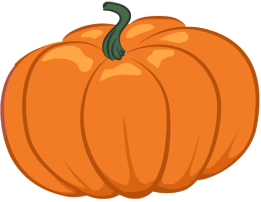

This page will host the schedule of topics for the course. Please note that this is an <strong>evolving</strong> document and any changes to the syllabus will be announced in class and via Canvas announcements and will subsequently reflect on this page. Remember to <strong>refresh this page </strong> to make sure you are viewing the most recent version of the schedule.   

# General overview

In this course, we will learn how to design, analyze, and communicate the findings from a research study, through the lens of replication. During the first part of the course, we will learn how to design a web-based experiment that mirrors a recently published study on sentence processing. We will then use data collected as part of a direct replication of this study to understand the basics of descriptive and inferential statistics. Armed with these tools, in the second part of the course, we will propose and implement conceptual replications and extensions of this study, collect and analyze real behavioral data, and communicate findings in a poster session as well as through a short report.

# Schedule of topics

<table>
        <tr>
            <th>Date</th>
            <th>Topic</th>
            <th>Assigned materials   [before class]</th>
            <th>Assignments due  [11.59 pm]</th> 
    <tbody>
    <tr><td>Sep. 1</td><td>Meet & greet</td><td>Pre-class survey [Canvas]</td><td></td>
    <tr><td style="text-align: center; vertical-align: middle;background-color:#E5E4E2" colspan = 4>Week 2: Replication and research design</td>
    <tr><td>Sep. 6</td><td>Why replicate?</td><td><i>Read</i>: Frank & Saxe (2012) <i>Read</i>: QALMRI <i>Do</i>: Experiment [Canvas]</td><td></td>
    <tr><td>Sep. 8</td><td>Anatomy of an experiment</td><td><i>Read</i>: Horchak & Garrido (2021) <i>Form</i>: Groups <i>Brainstorm</i>: Project ideas </td><td></td>
    <tr><td style="text-align: center; vertical-align: middle;background-color:#E5E4E2" colspan = 4>Week 3: Designing a web experiment </td>
    <tr><td>Sep. 13</td><td>Your first webpage</td><td><i>Watch</i>: HTML 101 video </td><td></td>
    <tr><td>Sep. 15</td><td>JSPsych 101</td><td><i>Schedule</i>: Group meeting with Abhilasha</td><td></td>
    <tr><td style="text-align: center; vertical-align: middle;background-color:#E5E4E2" colspan = 4>Week 4: Experiment building</td>
    <tr><td>Sep. 20</td><td>JSPsych timeline</td><td><i>Brainstorm</i>: Study design </td><td>Assignment 1 (build a webpage) due</td>
    <tr><td>Sep. 22</td><td>Conditional logic</td><td><i>Brainstorm</i>: Study materials</td><td></td>
    <tr><td style="text-align: center; vertical-align: middle;background-color:#E5E4E2" colspan = 4>Week 5: Recording data & all that</td>
    <tr><td>Sep. 27</td><td>Where's the data?</td><td></td><td></td>
    <tr><td>Sep. 29</td><td>Experiment workflow</td><td><i>Read</i>: Nosek et al. (2018) <i>Read</i>: Pre-registration primer</td><td></td>
    <tr><td style="text-align: center; vertical-align: middle;background-color:#E5E4E2" colspan = 4>Week 6: Visualizing data</td>
    <tr><td>Oct. 4</td><td>R 101</td><td>Download RStudio</td><td>Assignment 2 (build an experiment - I) due</td>
    <tr><td>Oct. 6</td><td>Plotting + descriptive statistics</td><td><i>Submit</i>: Plot for in-class activity [Canvas] <i>Do</i>: R Bootcamp [Chapter 1]</td><td></td>
    <tr><td>Oct. 11</td><td style="text-align: center; vertical-align: middle;background-color:#FFFFFF" colspan = 3> FALL BREAK!! </td>
    <tr><td style="text-align: center; vertical-align: middle;background-color:#E5E4E2" colspan = 4>Week 7: Manipulating data</td>
    <tr><td>Oct. 13</td><td>Manipulating data</td><td><i>Do</i>: R Bootcamp [Chapter 3]</td><td>Assignment 3 (pre-registration) due </td>
    <tr><td style="text-align: center; vertical-align: middle;background-color:#E5E4E2" colspan = 4>Week 8: Understanding data</td>
    <tr><td>Oct. 18</td><td>Inferential statistics</td><td></td><td></td>
    <tr><td>Oct. 20</td><td>Inferential statistics</td><td></td><td>Assignment 4 (descriptive statistics) due</td>
    <tr><td style="text-align: center; vertical-align: middle;background-color:#E5E4E2" colspan = 4>Week 9: Communicating science</td>
    <tr><td>Oct. 25</td><td>Storytelling</td><td></td><td></td>
    <tr><td style="text-align: center; vertical-align: middle;background-color:#E5E4E2" colspan = 4>Week 9-11: Designing your own study</td>
    <tr><td>Oct. 27</td><td>Experiment building</td><td></td><td>Assignment 5 (inferential statistics) due</td>
    <tr><td>Nov. 1</td><td>Experiment building</td><td></td><td></td>
    <tr><td>Nov. 3</td><td>Collecting data</td><td></td><td></td>
    <tr><td>Nov. 8</td><td>Catch up week</td><td></td><td></td>
    <tr><td>Nov. 10</td><td>Catch up week</td><td></td><td>Assignment 6 (build an experiment - II) due</td>
    <tr><td style="text-align: center; vertical-align: middle;background-color:#E5E4E2" colspan = 4>Week 12-13: Analyzing real data</td>
    <tr><td>Nov. 15</td><td>Analysis time</td><td></td><td></td>
    <tr><td>Nov. 17</td><td colspan = 3 style="text-align: center;">Psychonomics conference (no class)</td>
    <tr><td>Nov. 22</td><td>Analysis</td><td></td><td>Assignment 7 (analyze project data) due</td>
    <tr><td>Nov. 24</td><td style="text-align: center; vertical-align: middle;background-color:#FFFFFF" colspan = 3>  THANKSGIVING BREAK!! </td>
    <tr><td style="text-align: center; vertical-align: middle;background-color:#E5E4E2" colspan = 4>Week 14: Communicating replications</td>
    <tr><td>Nov. 29</td><td>Storytelling</td><td></td><td></td>
    <tr><td>Dec. 1</td><td>Reporting science</td><td></td><td>Assignment 8 (poster draft) due</td>
    <tr><td style="text-align: center; vertical-align: middle;background-color:#E5E4E2" colspan = 4>Week 15: Open science refresher</td>
    <tr><td>Dec. 6</td><td>Peer review</td><td></td><td>Assignment 9 (peer review) due</td>
    <tr><td>Dec. 8</td><td style="text-align: center;" colspan = 3>Symposia</td>
    <tr><td>Dec. 14</td><td></td><td></td><td>Assignment 10 (final report) due</td>